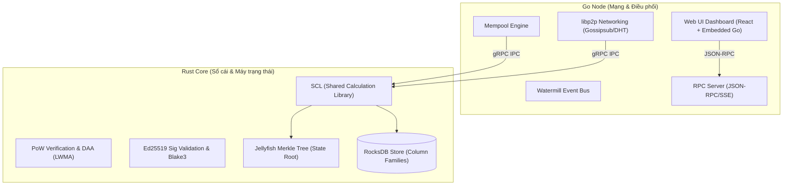

<!--
Tên file: TECHNOLOGY_OVERVIEW.md
Tính năng chi tiết: Tài liệu tổng quan kiến trúc công nghệ của dự án YonaCode
Ngày khởi tạo: 25/06/2026
Cơ chế vận hành: Tài liệu kỹ thuật chi tiết mô tả kiến trúc lai Rust-Go, cơ sở dữ liệu (RocksDB + JMT), mạng P2P libp2p, cơ chế mật mã học Blake3/Ed25519, tối ưu hiệu năng song song và hệ thống Web UI.
-->

# Tổng quan Công nghệ Dự án YonaCode

Dự án YonaCode sử dụng kiến trúc lai (hybrid) kết hợp hiệu năng tính toán an toàn của **Rust** và khả năng xử lý mạng phi tập trung mạnh mẽ của **Go**. Hệ thống được thiết kế theo mô hình tối giản, hướng tới bảo mật cao và vận hành tối ưu trên các thiết bị phần cứng thông thường.

---

## Sơ đồ Kiến trúc Lai (Rust-Go Multi-Process Architecture)

---

## 1. Ngôn ngữ & Kiến trúc phân lớp (Multi-Process Hybrid Architecture)

* **Rust Core (Sổ cái & Máy trạng thái):** Đảm nhiệm phần thư viện tính toán dùng chung (**SCL - Shared Calculation Library**), bao gồm quản lý trạng thái tài khoản, xác thực khối, đồng thuận PoW và mật mã học cốt lõi. Việc chọn Rust giúp tối ưu hóa hiệu năng tính toán biên dịch và loại bỏ hoàn toàn các lỗi an toàn bộ nhớ (memory safety).
* **Go Node (Tầng mạng & Điều phối):** Quản lý kết nối mạng ngang hàng (P2P), hàng đợi giao dịch chờ xử lý (Mempool), máy chủ RPC API và giao diện Web UI. Go sở hữu các thư viện mạng P2P trưởng thành và cơ chế concurrency cực kỳ tối ưu cho các luồng I/O mạng lớn.
* **Giao tiếp IPC hiệu năng cao:** Hai thành phần Rust và Go hoạt động trên hai tiến trình riêng biệt và kết nối thông qua **gRPC** (sử dụng thư viện **Tonic** phía Rust và **grpc-go** phía Go) trên giao diện mạng cục bộ hoặc Named Pipes (Windows) / Unix Sockets (Unix) để triệt tiêu độ trễ truyền dữ liệu.

---

## 2. Công nghệ Lưu trữ & Cấu trúc dữ liệu (State & Database Engine)

* **RocksDB:** Cơ sở dữ liệu dạng Khóa - Giá trị (Key-Value) tốc độ cao, được cấu hình phân tách theo nhiều *Column Families (CF)* chuyên biệt (tài khoản phẳng, tiêu đề khối, biên lai giao dịch và chỉ mục lịch sử). Hệ thống được tối ưu hóa bộ nhớ đệm (LRU block cache) và bộ đệm ghi (write buffer) lên tới 256MB để tránh tình trạng nghẽn nghẹt I/O đĩa cứng khi tải giao dịch lớn.
* **Jellyfish Merkle Tree (JMT):** Cấu trúc cây Merkle thưa (Sparse Merkle Tree) có phiên bản, dùng để quản lý trạng thái tài khoản và cung cấp bằng chứng mã hóa Merkle Proof cho StateRoot (tương tự mô hình của Aptos/Diem). JMT hỗ trợ cơ chế rollback trạng thái an toàn về các khối cũ mà không làm ảnh hưởng hay hỏng hóc dữ liệu phẳng hiện tại.

---

## 3. Tầng mạng phi tập trung (P2P Networking)

* **libp2p:** Bộ công cụ mạng ngang hàng chuẩn công nghiệp, hỗ trợ đa giao thức vận chuyển (TCP, UDP/QUIC), cơ chế UPnP/NAT-PMP đục lỗ tường lửa chủ động, AutoNAT tự chẩn đoán trạng thái mạng Public/Private, và Kademlia DHT giúp định tuyến và khám phá các node trong mạng hiệu quả.
* **Gossipsub:** Giao thức phát sóng thông tin hiệu năng cao dùng để lan truyền khối rút gọn (Compact Blocks), giao dịch, và các thông báo kiểm kê (Inventory - INV). Tích hợp bộ xác thực nghiêm ngặt để lọc bỏ các khối rác (PoW sai, lệch StateRoot) hoặc giao dịch lỗi ngay tại lớp mạng để tránh spam DoS.
* **Watermill (Event Bus):** Hệ thống PubSub nội bộ trong bộ nhớ để phân tách độc lập (decoupling) luồng xử lý dữ liệu giữa các mô-đun Mempool, SyncEngine và Network phía Go, giúp tối ưu hóa hiệu năng phản hồi của hệ thống.

---

## 4. Mật mã học & Bảo mật (Cryptography & Security Shield)

* **Blake3 Hashing:** Thuật toán băm thế hệ mới với tốc độ vượt trội, được sử dụng cho PoW và cấu trúc Merkle Tree. Hệ thống sử dụng cơ chế dẫn xuất khóa (DeriveKey) với chuỗi ngữ cảnh cố định `BTC GenZ Toi Gian PoW v1.0` để vô hiệu hóa hoàn toàn các thiết bị đào ASIC tiêu chuẩn trên thị trường, giữ mạng lưới phi tập trung ở mức tối đa.
* **Ed25519 Signatures:** Chuẩn chữ ký số Ed25519 được sử dụng để ký và xác thực các giao dịch. Lõi Rust tích hợp bộ đệm xác thực chữ ký (RwLock<HashMap>) sử dụng khóa băm Blake3 để bảo vệ hệ thống khỏi các cuộc tấn công bão chữ ký (Signature Bomb DoS).
* **Argon2id & AES-GCM:** Sử dụng thuật toán phái sinh khóa Argon2id kết hợp mã hóa AES-GCM để bảo mật khóa riêng tư của ví người dùng dưới dạng tệp tin JSON cục bộ, bảo vệ an toàn tài sản trước các cuộc tấn công brute-force.

---

## 5. Song song hóa & Tối ưu hóa Hiệu năng

* **Rayon (Rust):** Thư viện xử lý song song trên đa nhân CPU, được sử dụng trong lõi Rust để xác thực song song hàng nghìn chữ ký giao dịch của khối cùng lúc và phục vụ thợ đào khai thác PoW hiệu suất cao.
* **Parallel Prefetching:** Tải trước trạng thái tài khoản liên quan từ RocksDB vào RAM cache một cách song song trước khi thực thi chuỗi giao dịch trong khối, giúp giảm thiểu tối đa độ trễ đọc đĩa vật lý.
* **EBP (Exchange Batch Protocol):** Giao thức đóng gói và ký theo lô có thứ tự dành riêng cho các sàn giao dịch, giúp gộp hàng nghìn giao dịch vào một gói tin duy nhất, giảm 90% chi phí truyền tải mạng và tranh chấp khóa (lock contention).

---

## 6. Giao diện & Công cụ Quản trị

* **React Frontend:** Giao diện ví, bảng điều khiển (Dashboard) hiển thị hashrate, tổng cung, chiều cao khối và lịch sử giao dịch thời gian thực một cách trực quan và hiện đại.
* **Go Embed:** Toàn bộ bản build của giao diện Web UI được nhúng trực tiếp vào tệp tin thực thi Go thông qua tính năng `go:embed` giúp triển khai node cực kỳ gọn nhẹ chỉ với một tệp chạy chạy duy nhất trên mọi môi trường.
* **SSE (Server-Sent Events) & JSON-RPC:** Cung cấp luồng dữ liệu cập nhật trạng thái thời gian thực từ Node xuống trình duyệt của người dùng với độ trễ thấp và độ tin cậy cao.
